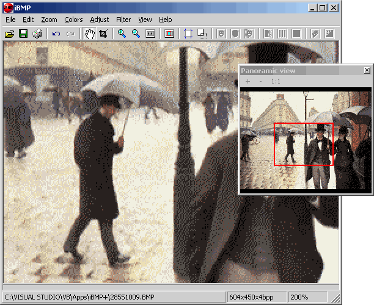



## iBMP 1\.2

### Description

A little update with some new features: JPEG, PNG, GIF (GDI+ default) and TIFF (24bpp) saving support (thanks to Avery for the great GDI+ stuff -CodeId=37541-), high-quality resizing, file dialog image preview support (thanks to Ark -CodeId=41320-), improved filters (specialy Despeckle -Thanks to Robert Rayment-). 

----

GDI+ is needed: http://www.microsoft.com/downloads/release.asp?releaseid=32738 

----

Zip 96Kb. Last update: 2004.05.15
 
### More Info
 

             |
---                |---
**Submitted On**   |2004-05-29 23:37:36
**By**             |[Carles P\.V\.](https://github.com/Planet-Source-Code/PSCIndex/blob/master/ByAuthor/carles-p-v.md)
**Level**          |Intermediate
**User Rating**    |5.0 (260 globes from 52 users)
**Compatibility**  |VB 6\.0
**Category**       |[Complete Applications](https://github.com/Planet-Source-Code/PSCIndex/blob/master/ByCategory/complete-applications__1-27.md)
**World**          |[Visual Basic](https://github.com/Planet-Source-Code/PSCIndex/blob/master/ByWorld/visual-basic.md)
**Archive File**   |[iBMP\_1\_21762996282004\.zip](https://github.com/Planet-Source-Code/carles-p-v-ibmp-1-2__1-42376/archive/master.zip)

